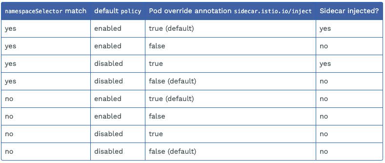
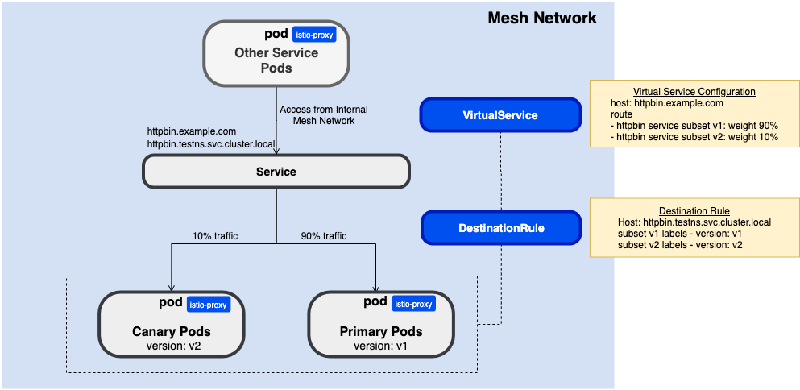

# istio-sandbox

This is my personal Istio sandbox repository where I play around with [Istio](https://istio.io/) by running sample configurations, testing their behaviors, and so on

<!-- TOC -->

- [istio-sandbox](#istio-sandbox)
  - [Install Istio](#install-istio)
    - [Install istioctl](#install-istioctl)
    - [Istioctl](#istioctl)
      - [Install istio using istioctl](#install-istio-using-istioctl)
      - [Customizing the configuration](#customizing-the-configuration)
    - [Istio Operator](#istio-operator)
      - [Install Istio Operator](#install-istio-operator)
      - [Install istio using Istio Operator](#install-istio-using-istio-operator)
      - [Customizing the configuration using Istio Operator](#customizing-the-configuration-using-istio-operator)
      - [In-place/Canary upgrade of Istio using the Operator](#in-placecanary-upgrade-of-istio-using-the-operator)
  - [Automatic Sidecar Injection](#automatic-sidecar-injection)
    - [Configure webhooks namespaceSelector](#configure-webhooks-namespaceselector)
    - [Configure default policy in ConfigMap istio-sidecar-injector](#configure-default-policy-in-configmap-istio-sidecar-injector)
    - [Per-pod override annotation](#per-pod-override-annotation)
  - [Traffic Management](#traffic-management)
    - [Install Test App](#install-test-app)
    - [INFO: Virtual Services and Destination Rules](#info-virtual-services-and-destination-rules)
    - [Condition match routing](#condition-match-routing)
    - [Fault Injection](#fault-injection)
      - [Delay](#delay)
      - [Abort](#abort)
    - [Timeout](#timeout)
      - [Request Timeout](#request-timeout)
      - [Connect Timeout](#connect-timeout)
      - [Idle Timeout](#idle-timeout)
    - [Retries](#retries)
      - [retries (perTryTimeout and retryOn)](#retries-pertrytimeout-and-retryon)
      - [retries and timeout](#retries-and-timeout)
      - [retry only for idempotent methods](#retry-only-for-idempotent-methods)
    - [Mirroring](#mirroring)
    - [Load Balancing](#load-balancing)
    - [Circuit Breaking](#circuit-breaking)
    - [Rate Limiting](#rate-limiting)
    - [Ingress](#ingress)
      - [Ingress Gateay and Gateway](#ingress-gateay-and-gateway)
      - [Integration with ALB](#integration-with-alb)
    - [Egress](#egress)
      - [Direct traffic to external services with Service Entries](#direct-traffic-to-external-services-with-service-entries)
      - [Accessng external services via Egress Gateway](#accessng-external-services-via-egress-gateway)
  - [Deployment models](#deployment-models)
    - [PoC: Multiple namespaces in a single cluster](#poc-multiple-namespaces-in-a-single-cluster)
  - [Operations](#operations)
    - [Check Envoy Access Logs (istio-proxy logs)](#check-envoy-access-logs-istio-proxy-logs)
    - [Get Istio configuration sync status (proxy-status)](#get-istio-configuration-sync-status-proxy-status)
    - [Debugging Envoy Configurations](#debugging-envoy-configurations)
    - [Istio Static Analysis (analyze)](#istio-static-analysis-analyze)
    - [ControlZ](#controlz)
  - [Other Topics](#other-topics)
    - [istio feature status](#istio-feature-status)

<!-- /TOC -->

## Install Istio

There are 3 ways to install, upgrade, and uninstall istio:

1. `Helm` (Human-triggered): Before istio 1.4, Helm has been the primary tool to install and upgrade Istio. But Helm installation method is currently in the process of deprecation.

2. `istioctl` (Human triggered): In istio 1.4+, istioctl can be used to apply the settings to the cluster. See [Install with Istioctl](https://istio.io/latest/docs/setup/install/istioctl/)

3. `Istio Operator` (Machine triggered): Instead of manual installation/upgrade istio with istioctl, you can instead let the [Istio Operator](https://istio.io/latest/docs/setup/install/operator/) manage the installation for you. It is continually watching for changes in that CRD and affecting those in real time.


### Install istioctl

```
curl -L https://istio.io/downloadIstio | sh -
```

`istio-1.7.4/bin/istioctl` をPATHに含める

### Istioctl
#### Install istio using istioctl

Create `istio-system` namespace
```
kubectl create namespace istio-system
```

install the `default` Istio configuration profile. See [configuration profile](https://istio.io/latest/docs/setup/additional-setup/config-profiles/) for more about istio installation profiles.

```bash
istioctl install -set profile=default

istioctl manifest generate --set profile=default | kubectl apply -f -

istioctl manifest generate --set profile=default > generated-manifest.yaml
```

You can [verify](https://istio.io/latest/docs/setup/install/istioctl/#verify-a-successful-installation) the manifest

```bash
istioctl verify-install -f generated-manifest.yaml
```

#### Customizing the configuration

```bash
istioctl install --set profile=default \
    --set meshConfig.accessLogFile=/dev/stdout \
    --set meshConfig.outboundTrafficPolicy.mode=REGISTRY_ONLY  # ALLOW_ANY or REGISTRY_ONLY
```

manifest generate
```bash
istioctl manifest generate --set profile=default \
    --set meshConfig.accessLogFile=/dev/stdout \
    --set meshConfig.outboundTrafficPolicy.mode=REGISTRY_ONLY # ALLOW_ANY or REGISTRY_ONLY
```

### Istio Operator

#### Install Istio Operator

Deploy the Istio operator

```bash
istioctl operator init
```
The command create the operator CRD, controller deploy, etc in the `istio-operator` namespace:

```bash
kubectl get all -n istio-operator

NAME                                  READY   STATUS    RESTARTS   AGE
pod/istio-operator-75c7cf68f6-7dmlf   1/1     Running   0          30m

NAME                     TYPE        CLUSTER-IP     EXTERNAL-IP   PORT(S)    AGE
service/istio-operator   ClusterIP   10.100.34.17   <none>        8383/TCP   30m

NAME                             READY   UP-TO-DATE   AVAILABLE   AGE
deployment.apps/istio-operator   1/1     1            1           30m

NAME                                        DESIRED   CURRENT   READY   AGE
replicaset.apps/istio-operator-75c7cf68f6   1         1         1       30m
```

You can configure which namespace the operator controller is installed in, the namespace(s) the operator watches, the installed Istio image sources and versions, and more. For example, you can pass one or more namespaces to watch using the `--watchedNamespaces` flag like this. Default namespace to watch is `istio-system`. See also [istio operator init option reference](https://istio.io/latest/docs/reference/commands/istioctl/#istioctl-operator-init)

In this case, watch not only `istio-system` but also `testns1` and `testns2`
```bash
# istioctl operator init --watchedNamespaces=istio-ns1,istio-ns2
istioctl operator init --watchedNamespaces=istio-system,testns1,testns2
```

#### Install istio using Istio Operator

First, create istio-system namespace

```bash
kubectl create ns istio-system
```

Then, install the Istio `default` configuration profile using the operator

```yaml
kubectl apply -f - <<EOF
apiVersion: install.istio.io/v1alpha1
kind: IstioOperator
metadata:
  namespace: istio-system
  name: example-istiocontrolplane
spec:
  profile: default
EOF
```

You can see istio configuration by checking `istio` configmap under the `istio-system` namespace

```bash
kubectl get cm istio -n istio-system -o yaml

apiVersion: v1
data:
  mesh: |-
    defaultConfig:
      discoveryAddress: istiod.istio-system.svc:15012
      proxyMetadata:
        DNS_AGENT: ""
      tracing:
        zipkin:
          address: zipkin.istio-system:9411
    disableMixerHttpReports: true
    enablePrometheusMerge: true
    rootNamespace: istio-system
    trustDomain: cluster.local
  meshNetworks: 'networks: {}'
kind: ConfigMap
metadata:
  annotations:
    kubectl.kubernetes.io/last-applied-configuration: |
      {"apiVersion":"v1","data":{"mesh":"defaultConfig:\n  discoveryAddress: istiod.istio-system.svc:15012\n  proxyMetadata:\n    DNS_AGENT: \"\"\n  tracing:\n    zipkin:\n      address: zipkin.istio-system:9411\ndisableMixerHttpReports: true\nenablePrometheusMerge: true\nrootNamespace: istio-system\ntrustDomain: cluster.local","meshNetworks":"networks: {}"},"kind":"ConfigMap","metadata":{"annotations":{},"labels":{"install.operator.istio.io/owning-resource":"example-istiocontrolplane","install.operator.istio.io/owning-resource-namespace":"istio-system","istio.io/rev":"default","operator.istio.io/component":"Pilot","operator.istio.io/managed":"Reconcile","operator.istio.io/version":"1.7.4","release":"istio"},"name":"istio","namespace":"istio-system"}}
  creationTimestamp: "2020-11-22T07:51:56Z"
  labels:
    install.operator.istio.io/owning-resource: example-istiocontrolplane
    install.operator.istio.io/owning-resource-namespace: istio-system
    istio.io/rev: default
    operator.istio.io/component: Pilot
    operator.istio.io/managed: Reconcile
    operator.istio.io/version: 1.7.4
    release: istio
  managedFields:
  - apiVersion: v1
    fieldsType: FieldsV1
    fieldsV1:
      f:data:
        .: {}
        f:mesh: {}
        f:meshNetworks: {}
      f:metadata:
        f:annotations:
          .: {}
          f:kubectl.kubernetes.io/last-applied-configuration: {}
        f:labels:
          .: {}
          f:install.operator.istio.io/owning-resource: {}
          f:install.operator.istio.io/owning-resource-namespace: {}
          f:istio.io/rev: {}
          f:operator.istio.io/component: {}
          f:operator.istio.io/managed: {}
          f:operator.istio.io/version: {}
          f:release: {}
    manager: operator
    operation: Update
    time: "2020-11-22T07:51:56Z"
  name: istio
  namespace: istio-system
  resourceVersion: "1574262"
  selfLink: /api/v1/namespaces/istio-system/configmaps/istio
  uid: 6699810f-eb83-4304-867a-da02a523dff1
```

#### Customizing the configuration using Istio Operator

You can change the Istio configuration by editing or replacing the `IstioOperator` resource.

For example, You can customize the default profile values.
- Enable the istio-egressgateway component
- Enable Access logging

```yaml
# kubectl apply -f manifests/operator.yaml

kubectl apply -f - <<EOF
apiVersion: install.istio.io/v1alpha1
kind: IstioOperator
metadata:
  namespace: istio-system
  name: example-istiocontrolplane
spec:
  profile: default
  meshConfig:
    accessLogFile: /dev/stdout
    enableTracing: true
  components:
    egressGateways:
    - name: istio-egressgateway
      enabled: true
EOF
```
See `IstioOperator API`(https://istio.io/latest/docs/reference/config/istio.operator.v1alpha1/) for the configuration settings.

You can observe how the operator change the configuration by checking the operator controller logs:

```
kubectl get po -n istio-operator
NAME                              READY   STATUS    RESTARTS   AGE
istio-operator-75c7cf68f6-7dmlf   1/1     Running   0          37m

kubectl logs istio-operator-75c7cf68f6-7dmlf -n istio-operator -f
```

#### In-place/Canary upgrade of Istio using the Operator

In-place vs. Canary upgrade

- https://istio.io/latest/docs/setup/install/operator/#in-place-upgrade
- https://istio.io/latest/docs/setup/install/operator/#canary-upgrade

## Automatic Sidecar Injection 

3 configuration items for Automatic Sidecar Injection
- webhooks `namespaceSelector` (istio-injection: enabled)
- default policy (Configured in the ConfigMap `istio-sidecar-injector`)
- per-pod override annotation (`sidecar.istio.io/inject`)

ref: https://istio.io/latest/blog/2019/data-plane-setup/#automatic-injection


ref: https://istio.io/latest/docs/ops/configuration/mesh/injection-concepts/

### Configure webhooks namespaceSelector

Let's label the namespace where you are deploying the app with `istio-injection=enabled`. Once labeled, Istio injects the sidecar automatically for any pod you deploy in that namespace depending on the `namespaceSelector` mechanism of the admission webhook.

Set namespace label to `testns1` namespace to instruct Istio to automatically inject Envoy sidecar proxies in namespace `testns1`

```bash
NAMESPACE=testns1
kubectl create namespace ${NAMESPACE}
kubectl label namespace ${NAMESPACE} istio-injection=enabled
```

Check if the label `istio-injection` is `enabled`

```bash
kubectl get ns ${NAMESPACE} --show-labels

NAME       STATUS   AGE   LABELS
testns1    Active   14m   istio-injection=enabled
```

### Configure default policy in ConfigMap istio-sidecar-injector

The automatic sidecar injection not only depends on the `namespaceSelector` mechanism of the webhook, but also on the default injection policy.

Let's take a look at istio-sidecar-injector configmap. As you can see, it is enabled by default
```
kubectl -n istio-system get configmap istio-sidecar-injector -o=jsonpath='{.data.config}'
```
```yaml
policy: enabled
alwaysInjectSelector:
  []
neverInjectSelector:
  []
injectedAnnotations:

template: |
..
```

You can change the default policy by directly editing the configmap
```
kubectl -n istio-system edit configmap istio-sidecar-injector 
```

### Per-pod override annotation

In addition, the automatic sidecar injection depends on the per-pod override annotation - `sidecar.istio.io/inject: "false"`

```yaml
apiVersion: extensions/v1beta1
kind: Deployment
metadata:
  name: ignored
spec:
  template:
    metadata:
      annotations:
        sidecar.istio.io/inject: "false"
    spec:
      containers:
      - name: ignored
        image: curlimages/curl
        command: ["/bin/sleep","infinity"]
```

## Traffic Management

### Install Test App

Frist of all, create namespaces named `testns1` and `testns2`, both of which are labeled `istio-injection: enabled` to instruct Istio to automatically inject Envoy sidecar proxies when you deploy your application later
```yaml
# kubectl apply -f manifests/namespace.yaml

kubectl apply -f - <<EOF
apiVersion: v1
kind: Namespace
metadata:
  name: testns1
  labels:
    istio-injection: enabled
---
apiVersion: v1
kind: Namespace
metadata:
  name: testns2
  labels:
    istio-injection: enabled
EOF
```

Then, deploy sample app, httpbin under the `testns1` namespace.
```yaml
# kubectl apply -f manifests/httpbin.yaml -n testns1

kubectl apply -n testns1 -f - <<EOF
apiVersion: v1
kind: ServiceAccount
metadata:
  name: httpbin
---
apiVersion: v1
kind: Service
metadata:
  name: httpbin
  labels:
    app: httpbin
spec:
  ports:
  - name: http
    port: 8000
    targetPort: 80
  selector:
    app: httpbin
---
apiVersion: apps/v1
kind: Deployment
metadata:
  name: httpbin-v1
spec:
  replicas: 1
  selector:
    matchLabels:
      app: httpbin
      version: v1
  template:
    metadata:
      labels:
        app: httpbin
        version: v1
    spec:
      serviceAccountName: httpbin
      containers:
      - image: docker.io/kennethreitz/httpbin
        imagePullPolicy: IfNotPresent
        name: httpbin
        command: ["gunicorn", "--access-logfile", "-", "-b", "0.0.0.0:80", "httpbin:app"]
        ports:
        - containerPort: 80
---
apiVersion: apps/v1
kind: Deployment
metadata:
  name: httpbin-v2
spec:
  replicas: 1
  selector:
    matchLabels:
      app: httpbin
      version: v2
  template:
    metadata:
      labels:
        app: httpbin
        version: v2
    spec:
      serviceAccountName: httpbin
      containers:
      - image: docker.io/kennethreitz/httpbin
        imagePullPolicy: IfNotPresent
        name: httpbin
        command: ["gunicorn", "--access-logfile", "-", "-b", "0.0.0.0:80", "httpbin:app"]
        ports:
        - containerPort: 80
EOF
```

Finally, deploy test client pods under both `testns1` and `testns2` namespace
```yaml
# kubectl apply -f manifests/sleep.yaml -n testns1
# kubectl apply -f manifests/sleep.yaml -n testns1

kubectl apply -n testns1 -f - <<EOF
apiVersion: apps/v1
kind: Deployment
metadata:
  name: sleep
spec:
  replicas: 1
  selector:
    matchLabels:
      app: sleep
  template:
    metadata:
      labels:
        app: sleep
    spec:
      containers:
      - name: sleep
        image: curlimages/curl
        command: ["/bin/sleep","infinity"]
        imagePullPolicy: IfNotPresent
EOF

kubectl apply -n testns1 -f - <<EOF
apiVersion: apps/v1
kind: Deployment
metadata:
  name: sleep
spec:
  replicas: 1
  selector:
    matchLabels:
      app: sleep
  template:
    metadata:
      labels:
        app: sleep
    spec:
      containers:
      - name: sleep
        image: curlimages/curl
        command: ["/bin/sleep","infinity"]
        imagePullPolicy: IfNotPresent
EOF
```

### INFO: Virtual Services and Destination Rules



- https://istio.io/latest/docs/concepts/traffic-management/#virtual-services
- https://istio.io/latest/docs/concepts/traffic-management/#destination-rules

You use `virtual services` to configure how you route your traffic to a given destination while you use `destination rules` to configure policies that can be applied to the traffic for that destination. `Destination rules` are applied after virtual service routing rules are evaluated

- [Virtual Servcies](https://istio.io/latest/docs/reference/config/networking/virtual-service/): Route traffics to the destinaion
  - Traffic Splits
  - Condition match routing
  - Retries
  - Timeout
  - Fault injection
  - Circuit Breaking
- [Destination Rules](https://istio.io/latest/docs/reference/config/networking/destination-rule/): Defines subsets for the destination service and traffic policies to appliy routed traffic to the destination
  - Traffic polities
    - loadBalancer
    - connectionPool
    - outlierDetection

### Condition match routing

The following example Virtual Service routes 90% of traffic to httpbin service to subset v1 in th service and 10% of traffic to httpbin service to subset v2 in the service.

First of all, deploy the destination rules under `testns1` namespace

```yaml
# kubectl apply -f manifests/destinationrule.yaml -n testns1
kubectl apply -n testns1 -f - <<EOF
apiVersion: networking.istio.io/v1alpha3
kind: DestinationRule
metadata:
  name: httpbin
spec:
  host: httpbin.testns1.svc.cluster.local
  subsets:
  - name: v1
    labels:
      version: v1
  - name: v2
    labels:
      version: v2
EOF
```

Then, deploy the virtual services under `testns1` namespace
```yaml
# kubectl apply -f manifests/virtualservice-90-10.yaml -n testns1

kubectl apply -n testns1 -f - <<EOF
apiVersion: networking.istio.io/v1alpha3
kind: VirtualService
metadata:
  name: httpbin
spec:
  hosts:
  - httpbin.testns1.svc.cluster.local
  gateways:
  - mesh   # (default)
  http:
  - match:
    - uri:
        exact: /headers
    - uri:
        prefix: /status
    - uri:
        prefix: /delay
    route:
    - destination:
        host: httpbin.testns1.svc.cluster.local
        port:
          number: 8000
        subset: v1
      weight: 90
    - destination:
        host: httpbin.testns1.svc.cluster.local
        port:
          number: 8000
        subset: v2
      weight: 10
EOF
```

> [Key Point] Traffic to httpbin service:
> - subset v1 in Virtual Service -> route traffic to version labeled v1 endpoint
> - subset v2 in Virtual Service -> route traffic to version labeled v2 endpoint


Send the HTTP request to http://httpbin.testns1.svc.cluster.local/headers repeatedly.
```bash
export NAMESPACE=testns1
export SLEEP_POD=$(kubectl get pod -l app=sleep -n $NAMESPACE -o jsonpath={.items..metadata.name})
watch kubectl exec "${SLEEP_POD}" -c sleep -n $NAMESPACE -- curl -s "http://httpbin.${NAMESPACE}.svc.cluster.local/headers"
```

Check istio-proxy logs for each Pods (v1 and v2), then you'll see 90% traffic go to v1 pod, and 10% to v2 pod.

```bash
kubectl get po -n testns1

NAME                          READY   STATUS    RESTARTS   AGE
httpbin-v1-79dbdd9784-98vg6   2/2     Running   0          14m
httpbin-v2-d98698f69-4jf9f    2/2     Running   0          14m
sleep-5d8cb77dd8-q8l46        2/2     Running   0          10m

kubectl logs httpbin-v1-79dbdd9784-98vg6 -n testns1 -c istio-proxy -f --tail 0
kubectl logs httpbin-v2-d98698f69-4jf9f -n testns1 -c istio-proxy -f --tail 0
```

### Fault Injection

#### Delay
The configuration below causes 50% fault (3 sec delay)

```yaml
# kubectl apply -f manifests/virtualservice-fault-delay.yaml -n testns1

kubectl apply -n testns1 -f - <<EOF
apiVersion: networking.istio.io/v1alpha3
kind: VirtualService
metadata:
  name: httpbin
spec:
  hosts:
  - httpbin.testns1.svc.cluster.local
  http:
  - fault:
      delay:
        percent: 50
        fixedDelay: 3s
    route:
    - destination:
        host: httpbin.testns1.svc.cluster.local
        port:
          number: 8000
        subset: v1
      weight: 100
EOF
```

Send the HTTP request to http://httpbin.testns1.svc.cluster.local/headers repeatedly, and you'll see 50% of requests get 3 sec delayed
```bash
export NAMESPACE=testns1
export SLEEP_POD=$(kubectl get pod -l app=sleep -n $NAMESPACE -o jsonpath={.items..metadata.name})
watch kubectl exec "${SLEEP_POD}" -c sleep -n $NAMESPACE -- curl -sv "http://httpbin.${NAMESPACE}.svc.cluster.local/headers"
```

#### Abort

The configuration below causes 100% fault (abort) when you send a request to the httpbin service with with a specific header `client-id: gogo123`

```yaml
# kubectl apply -f manifests/virtualservice-fault-abort.yaml -n testns1

kubectl apply -n testns1 -f - <<EOF
apiVersion: networking.istio.io/v1alpha3
kind: VirtualService
metadata:
  name: httpbin
spec:
  hosts:
  - httpbin.testns1.svc.cluster.local
  gateways:
  - mesh
  http:
  - fault:
      abort:
        httpStatus: 500
        percentage:
          value: 100
    match:
    - headers:
        client-id:
          exact: gogo123
    route:
    - destination:
        host: httpbin.testns1.svc.cluster.local
        port:
          number: 8000
        subset: v1
EOF
```

Send the HTTP request to http://httpbin.testns1.svc.cluster.local/headers with a specific header `client-id: gogo123` repeatedly.

```bash
export NAMESPACE=testns1
export SLEEP_POD=$(kubectl get pod -l app=sleep -n $NAMESPACE -o jsonpath={.items..metadata.name})
watch kubectl exec "${SLEEP_POD}" -c sleep -n $NAMESPACE -- curl -H \"client-id: gogo123\" -sv  "http://httpbin.${NAMESPACE}.svc.cluster.local/headers"
```

You'll see 100% of request get aborted with http status `500`
```txt
* Hostname was NOT found in DNS cache
fault filter abort*   Trying 10.100.62.214...
* Connected to httpbin.testns1.svc.cluster.local (10.100.62.214) port 80 (#0)
> GET /headers HTTP/1.1
> User-Agent: curl/7.35.0
> Host: httpbin.testns1.svc.cluster.local
> Accept: */*
> client-id:gogo123
>
< HTTP/1.1 500 Internal Server Error
< content-length: 18
< content-type: text/plain
< date: Mon, 23 Nov 2020 09:02:33 GMT
* Server envoy is not blacklisted
< server: envoy
```

See also [Injecting an HTTP delay fault](https://istio.io/latest/docs/tasks/traffic-management/fault-injection/#injecting-an-http-delay-fault)

### Timeout

#### Request Timeout
The configuration below set 10 sec timeout for a request to the httpbin service.

```yaml
# kubectl apply -f manifests/virtualservice-timeout.yaml -n testns1

kubectl apply -n testns1 -f - <<EOF
apiVersion: networking.istio.io/v1alpha3
kind: VirtualService
metadata:
  name: httpbin
spec:
  hosts:
  - httpbin.testns1.svc.cluster.local 
  http:
  - route:
    - destination:
        host: httpbin.testns1.svc.cluster.local 
        port:
          number: 8000
        subset: v1
    timeout: 10s
EOF
```

Send the HTTP request to http://httpbin.testns1.svc.cluster.local/delay/15. The endpoint is supposed to return a response after 15 sec.

```bash
export NAMESPACE=testns1
export SLEEP_POD=$(kubectl get pod -l app=sleep -n $NAMESPACE -o jsonpath={.items..metadata.name})
kubectl exec "${SLEEP_POD}" -c sleep -n $NAMESPACE -- curl -sv "http://httpbin.${NAMESPACE}.svc.cluster.local/delay/15"
```

You'll see 504 gateway timeout 10 sec after you send the request
```txt
* Connected to httpbin.testns1.svc.cluster.local (10.100.62.214) port 80 (#0)
> GET /delay/15 HTTP/1.1
> User-Agent: curl/7.35.0
> Host: httpbin.testns1.svc.cluster.local
> Accept: */*
>
< HTTP/1.1 504 Gateway Timeout
< content-length: 24
< content-type: text/plain
< upstream request timeoutdate: Mon, 23 Nov 2020 09:19:47 GMT
* Server envoy is not blacklisted
< server: envoy
```
See also [Request Timeouts](https://istio.io/latest/docs/tasks/traffic-management/request-timeouts/)

#### Connect Timeout
The configuration below set 4 sec tcp connection timeout for a request to the non-existent service.

Prepare a non-existent service and check the connect timeout.
The ip in the Endpoints resource should be a non-existent IP address.

```yaml
# kubectl apply -f manifests/non-existent-service.yaml -n testns1

kubectl apply -n testns1 -f - <<EOF
apiVersion: v1
kind: Service
metadata:
  name: non-existent-service
spec:
  clusterIP: None
---
apiVersion: v1
kind: Endpoints
metadata:
  name: non-existent-service
subsets:
  - addresses:
    - ip: <non-existent IP address>
---
apiVersion: networking.istio.io/v1alpha3
kind: ServiceEntry
metadata:
  name: non-existent-service
spec:
  hosts:
  - non-existent-service.testns1.svc.cluster.local
  ports:
  - number: 80
    name: http
    protocol: HTTP
  resolution: DNS
  location: MESH_EXTERNAL
EOF
```

Set the tcp connection timeout in spec.trafficPolicy.connectionPool.tcp.connectTimeout in DestinationRule.
(The default is 10 sec.)
```yaml
# kubectl apply -f manifests/virtualservice-non-existent-service.yaml -n testns1

kubectl apply -n testns1 -f - <<EOF
apiVersion: networking.istio.io/v1alpha3
kind: VirtualService
metadata:
  name: non-existent-service
spec:
  hosts:
  - non-existent-service.testns1.svc.cluster.local 
  http:
  - route:
    - destination:
        host: non-existent-service.testns1.svc.cluster.local 
        port:
          number: 80
    retries:
      attempts: 0
EOF

# kubectl apply -f manifests/destination-rule-connect-timeout.yaml -n testns1

kubectl apply -n testns1 -f - <<EOF
apiVersion: networking.istio.io/v1alpha3
kind: DestinationRule
metadata:
  name: non-existent-service
spec:
  host: non-existent-service.testns1.svc.cluster.local
  trafficPolicy:
    connectionPool:
      tcp:
        connectTimeout: 4s
EOF
```

Send the HTTP request to http://non-existent-srevice.testns1.svc.cluster.local/. The IP address of this endpoint is invalid, so the request will fail and trigger a connection timeout after 4 sec.

```bash
export NAMESPACE=testns1
export SLEEP_POD=$(kubectl get pod -l app=sleep -n $NAMESPACE -o jsonpath={.items..metadata.name})
kubectl exec "${SLEEP_POD}" -c sleep -n $NAMESPACE -- curl -sv "http://non-existent-service.${NAMESPACE}.svc.cluster.local/"
```

You'll see 503 timeout 4 sec after you send the request
```txt
* Connected to non-existent-service.testns1.svc.cluster.local (10.100.62.253) port 80 (#0)
> GET / HTTP/1.1
> Host: non-existent-service.testns1.svc.cluster.local
> User-Agent: curl/7.77.0-DEV
> Accept: */*
>
* Mark bundle as not supporting multiuse
< HTTP/1.1 503 Service Unavailable
< content-length: 84
< content-type: text/plain
< date: Tue, 22 Jun 2021 07:18:55 GMT
< server: envoy
<
* Connection #0 to host non-existent-service.testns1.svc.cluster.local left intact
```

See also [ConnectionPoolSetting.TCPSettings](https://istio.io/latest/docs/reference/config/networking/destination-rule/#ConnectionPoolSettings-TCPSettings)

#### Idle Timeout
The configuration below set 5 sec http idle timeout for a request to the non-existent service.

Using the service created in [Connect Timeout](#connect-timeout), delete the connectTimeout and set idleTimeout to 5 sec in DestinationRule.
The default value of connectTimeout is 10 sec, so the request will timeout at idleTimeout 5 sec.

Set the http idle timeout in spec.trafficPolicy.connectionPool.http.idleTimeout in DestinationRule.
(The default is 1 hour.)
```yaml
# kubectl apply -f manifests/destination-rule-idle-timeout.yaml -n testns1

kubectl apply -n testns1 -f - <<EOF
apiVersion: networking.istio.io/v1alpha3
kind: DestinationRule
metadata:
  name: non-existent-service
spec:
  host: non-existent-service.testns1.svc.cluster.local
  trafficPolicy:
    connectionPool:
      http:
        idleTimeout: 5s
EOF
```

Send the HTTP request to http://non-existent-service.testns1.svc.cluster.local/. The IP address of this endpoint is invalid, so the request will fail and trigger a idle timeout after 5 sec.

```bash
export NAMESPACE=testns1
export SLEEP_POD=$(kubectl get pod -l app=sleep -n $NAMESPACE -o jsonpath={.items..metadata.name})
kubectl exec "${SLEEP_POD}" -c sleep -n $NAMESPACE -- curl -sv "http://non-existent-service.${NAMESPACE}.svc.cluster.local/"
```

You'll see 503 timeout 5 sec after you send the request
```txt
* Connected to non-existent-service.testns1.svc.cluster.local (10.100.62.253) port 80 (#0)
> GET / HTTP/1.1
> Host: non-existent-service.testns1.svc.cluster.local
> User-Agent: curl/7.77.0-DEV
> Accept: */*
>
* Mark bundle as not supporting multiuse
< HTTP/1.1 503 Service Unavailable
< content-length: 84
< content-type: text/plain
< date: Tue, 22 Jun 2021 07:18:55 GMT
< server: envoy
<
* Connection #0 to host non-existent-service.testns1.svc.cluster.local left intact
```

See also [ConnectionPoolSetting.HTTPSettings](https://istio.io/latest/docs/reference/config/networking/destination-rule/#ConnectionPoolSettings-HTTPSettings)

### Retries

A retry setting specifies the maximum number of times an Envoy proxy attempts to connect to a service if the initial call fails. The interval between retries (`25ms+`) is variable and determined automatically by Istio.

About Envoy retries Algorithm: by default, Envoy uses a **fully jittered exponential back-off algorithm** for retries with a default base interval of 25ms. Given a base interval B and retry number N, the back-off for the retry is in the range [0,(2𝑁−1)𝐵), according to [envoy doc](https://www.envoyproxy.io/docs/envoy/latest/configuration/http/http_filters/router_filter#config-http-filters-router-x-envoy-max-retries).

#### retries (perTryTimeout and retryOn)

The following example configures a maximum of 3 retries to connect to this service subset after an initial call failure (`5xx` errors or [connection-failure](https://www.envoyproxy.io/docs/envoy/latest/configuration/http/http_filters/router_filter#x-envoy-retry-on)), each with a `2` second timeout.

```yaml
# kubectl apply -f manifests/virtualservice-retries.yaml -n testns1

kubectl apply -n testns1 -f - <<EOF
apiVersion: networking.istio.io/v1alpha3
kind: VirtualService
metadata:
  name: httpbin
spec:
  hosts:
  - httpbin.testns1.svc.cluster.local
  http:
  - route:
    - destination:
        host: httpbin.testns1.svc.cluster.local
        port:
          number: 8000
        subset: v1
    retries:
      attempts: 3
      perTryTimeout: 2s
      retryOn: 5xx, connect-failure
EOF
```

See also the following pages for more details on retries:
- [Istio Traffic Management - Retries](https://istio.io/latest/docs/concepts/traffic-management/#retries)
- [x-envoy-retry-on](https://www.envoyproxy.io/docs/envoy/latest/configuration/http/http_filters/router_filter#x-envoy-retry-on)

#### retries and timeout

You can also combine retries with timeout configuration like this:

```yaml
# kubectl apply -f manifests/virtualservice-retries-timeout.yaml -n testns1

kubectl apply -n testns1 -f - <<EOF
apiVersion: networking.istio.io/v1alpha3
kind: VirtualService
metadata:
  name: httpbin
spec:
  hosts:
  - httpbin.testns1.svc.cluster.local
  http:
  - route:
    - destination:
        host: httpbin.testns1.svc.cluster.local
        port:
          number: 8000
        subset: v1
    retries:
      attempts: 3
      perTryTimeout: 2s
      retryOn: 5xx,connect-failure
    timeout: 10s
EOF
```
- It allows maximum of 3 retries, each with a `2` second timeout.
- Max time period given for the request is `10 sec` (10 sec timeout for the request)
- Whichever (either 3 retries or 10 sec timeout ) comes first cause a request failure

Send the HTTP request to http://httpbin.testns1.svc.cluster.local/delay/15. The endpoint is supposed to return a response after 15 sec.

```bash
export NAMESPACE=testns1
export SLEEP_POD=$(kubectl get pod -l app=sleep -n $NAMESPACE -o jsonpath={.items..metadata.name})
kubectl exec "${SLEEP_POD}" -c sleep -n $NAMESPACE -- curl -sv "http://httpbin.${NAMESPACE}.svc.cluster.local/delay/15"
```

You'll see 504 gateway timeout 6+ sec after you send the request. What happend is it ended upt with 504 Gateway Timeout after 3 retries with each 2 sec timeout.
```txt
* Hostname was NOT found in DNS cache
*   Trying 10.100.62.214...
* Connected to httpbin.testns1.svc.cluster.local (10.100.62.214) port 80 (#0)
> GET /delay/15 HTTP/1.1
> User-Agent: curl/7.35.0
> Host: httpbin.testns1.svc.cluster.local
> Accept: */*
>
upstream request timeout< HTTP/1.1 504 Gateway Timeout
< content-length: 24
< content-type: text/plain
< date: Mon, 23 Nov 2020 10:52:14 GMT
* Server envoy is not blacklisted
< server: envoy
```

You can observed 3 retries from envoy access logs (istio-proxy in v1 Pod)
```txt
kubectl logs <v1 pod> -n testns1 -c istio-proxy -f --tail 0

[2020-11-23T10:52:06.553Z] "GET /delay/15 HTTP/1.1" 0 DC "-" "-" 0 0 2001 - "-" "curl/7.35.0" "fc786864-ce72-4eae-9e20-9d9df1ac26ac" "httpbin.testns1.svc.cluster.local" "127.0.0.1:80" inbound|8000|http|httpbin.testns1.svc.cluster.local 127.0.0.1:45108 192.168.94.99:80 192.168.64.239:55138 outbound_.8000_.v1_.httpbin.testns1.svc.cluster.local default
[2020-11-23T10:52:08.580Z] "GET /delay/15 HTTP/1.1" 0 DC "-" "-" 0 0 1999 - "-" "curl/7.35.0" "fc786864-ce72-4eae-9e20-9d9df1ac26ac" "httpbin.testns1.svc.cluster.local" "127.0.0.1:80" inbound|8000|http|httpbin.testns1.svc.cluster.local 127.0.0.1:45148 192.168.94.99:80 192.168.64.239:55178 outbound_.8000_.v1_.httpbin.testns1.svc.cluster.local default
[2020-11-23T10:52:10.615Z] "GET /delay/15 HTTP/1.1" 0 DC "-" "-" 0 0 1999 - "-" "curl/7.35.0" "fc786864-ce72-4eae-9e20-9d9df1ac26ac" "httpbin.testns1.svc.cluster.local" "127.0.0.1:80" inbound|8000|http|httpbin.testns1.svc.cluster.local 127.0.0.1:45168 192.168.94.99:80 192.168.64.239:55198 outbound_.8000_.v1_.httpbin.testns1.svc.cluster.local default
[2020-11-23T10:52:12.711Z] "GET /delay/15 HTTP/1.1" 0 DC "-" "-" 0 0 1999 - "-" "curl/7.35.0" "fc786864-ce72-4eae-9e20-9d9df1ac26ac" "httpbin.testns1.svc.cluster.local" "127.0.0.1:80" inbound|8000|http|httpbin.testns1.svc.cluster.local 127.0.0.1:45190 192.168.94.99:80 192.168.64.239:55220 outbound_.8000_.v1_.httpbin.testns1.svc.cluster.local default
```

#### retry only for idempotent methods
You can also configure retries only for idempotent methods (ex. GET method) like this:

```yaml
# kubectl apply -f manifests/virtualservice-retry-only-idempotent.yaml -n testns1

kubectl apply -n testns1 -f - <<EOF
apiVersion: networking.istio.io/v1alpha3
kind: VirtualService
metadata:
  name: httpbin
spec:
  hosts:
  - httpbin.testns1.svc.cluster.local
  http:
  - match:
    - uri:
        prefix: /status
      method:
        exact: GET
    - uri:
        prefix: /delay
      method:
        exact: GET
    timeout: 10s
    retries:
      attempts: 2
      perTryTimeout: 3s
      retryOn: 5xx,connect-failure
    route:
    - destination:
        host: httpbin.testns1.svc.cluster.local
        port:
          number: 8000
        subset: v1
  - match:
    - uri:
        prefix: /status
      method:
        exact: POST
    - uri:
        prefix: /delay
      method:
        exact: POST
    timeout: 3s
    route:
    - destination:
        host: httpbin.testns1.svc.cluster.local
        port:
          number: 8000
        subset: v1
EOF
```

for GET (idempotent) methods
- It allows maximum of 2 retries, each with a `3` second timeout.
- Max time period given for the request is `10 sec` (10 sec timeout for the request)
- Whichever (either 2 retries or 10 sec timeout ) comes first cause a request failure

for POST (non-idempotent) methods
- It doesn't retries if the initial call fails.
- Max time period given for the request is `3 sec` (10 sec timeout for the request)


You'll see retries only for GET methods, and no retries for POST methods.
```bash
kubectl exec "${SLEEP_POD}" -c sleep -n $NAMESPACE -- curl -s -X GET "http://httpbin.${NAMESPACE}.svc.cluster.local/delay/2" -o /dev/null -w "status_code:%{http_code}\nresponse_time:%{time_starttransfer}\n"
status_code:200
response_time:2.029813

kubectl exec "${SLEEP_POD}" -c sleep -n $NAMESPACE -- curl -s -X GET "http://httpbin.${NAMESPACE}.svc.cluster.local/delay/4" -o /dev/null -w "status_code:%{http_code}\nresponse_time:%{time_starttransfer}\n"
status_code:504
response_time:9.108819

kubectl exec "${SLEEP_POD}" -c sleep -n $NAMESPACE -- curl -s -X POST "http://httpbin.${NAMESPACE}.svc.cluster.local/delay/2" -o /dev/null -w "status_code:%{http_code}\nresponse_time:%{time_starttransfer}\n"
status_code:200
response_time:2.016482

kubectl exec "${SLEEP_POD}" -c sleep -n $NAMESPACE -- curl -s -X POST "http://httpbin.${NAMESPACE}.svc.cluster.local/delay/4" -o /dev/null -w "status_code:%{http_code}\nresponse_time:%{time_starttransfer}\n"
status_code:504
response_time:3.025275
```

### Mirroring

The configuration below allow to sends a copy of live traffic (traffic to v1) to a mirrored service (v2). This is an demonstration of Istio's traffic mirroring ((also called `shadowing`) capability

```yaml
# kubectl apply  -f manifests/virtualservice-mirror.yaml -n testns1

kubectl apply -n testns1 -f - <<EOF
apiVersion: networking.istio.io/v1alpha3
kind: VirtualService
metadata:
  name: httpbin
spec:
  hosts:
  - httpbin.testns1.svc.cluster.local 
  gateways:
  - mesh
  http:
  - route:
    - destination:
        host: httpbin.testns1.svc.cluster.local 
        port:
          number: 8000
        subset: v1
      weight: 100
    # Mirror 100% traffic for v1 to v2 service:
    mirror:
      host: httpbin.testns1.svc.cluster.local 
      port:
        number: 8000
      subset: v2
    mirror_percent: 100
EOF
```

Send the HTTP request to http://httpbin.testns1.svc.cluster.local/headers repeatedly.
```bash
export NAMESPACE=testns1
export SLEEP_POD=$(kubectl get pod -l app=sleep -n $NAMESPACE -o jsonpath={.items..metadata.name})
watch kubectl exec "${SLEEP_POD}" -c sleep -n $NAMESPACE -- curl -s "http://httpbin.${NAMESPACE}.svc.cluster.local/headers"
```

Check istio-proxy logs for both Pods (v1 and v2), then you'll see 100% traffic to v1 Pod is mirrored to v2 pod. You'll notice that service name has `-shadow` postfix like `httpbin.testns1.svc.cluster.local-shadow` in mirroed traffic logs in v2 pod proxy.

```bash
kubectl logs <v1 pod> -n testns1 -c istio-proxy -f --tail 0

[2020-11-23T11:13:57.472Z] "GET /headers HTTP/1.1" 200 - "-" "-" 0 574 3 2 "-" "curl/7.35.0" "cbd6f1e6-133e-4cdf-aaa6-c480e1c2eb0c" "httpbin.testns1.svc.cluster.local" "127.0.0.1:80" inbound|8000|http|httpbin.testns1.svc.cluster.local 127.0.0.1:59662 192.168.94.99:80 192.168.64.239:38142 outbound_.8000_.v1_.httpbin.testns1.svc.cluster.local default
[2020-11-23T11:14:05.013Z] "GET /headers HTTP/1.1" 200 - "-" "-" 0 574 2 2 "-" "curl/7.35.0" "c7ca839f-1c3f-4024-b09f-ecf4dbf6de2a" "httpbin.testns1.svc.cluster.local" "127.0.0.1:80" inbound|8000|http|httpbin.testns1.svc.cluster.local 127.0.0.1:59752 192.168.94.99:80 192.168.64.239:38142 outbound_.8000_.v1_.httpbin.testns1.svc.cluster.local default


kubectl logs <v2 pod> -n testns1 -c istio-proxy -f --tail 0

[2020-11-23T11:13:57.473Z] "GET /headers HTTP/1.1" 200 - "-" "-" 0 614 1 1 "192.168.64.239" "curl/7.35.0" "cbd6f1e6-133e-4cdf-aaa6-c480e1c2eb0c" "httpbin.testns1.svc.cluster.local-shadow" "127.0.0.1:80" inbound|8000|http|httpbin.testns1.svc.cluster.local 127.0.0.1:59664 192.168.76.21:80 192.168.64.239:0 outbound_.8000_.v2_.httpbin.testns1.svc.cluster.local default
[2020-11-23T11:14:05.013Z] "GET /headers HTTP/1.1" 200 - "-" "-" 0 614 2 2 "192.168.64.239" "curl/7.35.0" "c7ca839f-1c3f-4024-b09f-ecf4dbf6de2a" "httpbin.testns1.svc.cluster.local-shadow" "127.0.0.1:80" inbound|8000|http|httpbin.testns1.svc.cluster.local 127.0.0.1:59754 192.168.76.21:80 192.168.64.239:0 outbound_.8000_.v2_.httpbin.testns1.svc.cluster.local default
```

See also [Traffic Management - Mirroring](https://istio.io/latest/docs/tasks/traffic-management/mirroring/)


### Load Balancing

```yaml
apiVersion: networking.istio.io/v1alpha3
kind: DestinationRule
metadata:
  name: httpbin
spec:
  host: httpbin.testns1.svc.cluster.local
  trafficPolicy:
    loadBalancer:
      simple: LEAST_CONN
  subsets:
  - name: v1
    labels:
      version: v1
  - name: v2
    labels:
      version: v2
```
- https://istio.io/latest/docs/reference/config/networking/destination-rule/#LoadBalancerSettings
- https://istio.io/latest/docs/reference/config/networking/destination-rule/#LoadBalancerSettings-SimpleLB


### Circuit Breaking

Circuit breaker is a design pattern used in software development. It is used to limit the impact of failures, latency spikes, and other undesirable effects of network peculiarities. See [Circuit Breaker - Martin Fowler](https://martinfowler.com/bliki/CircuitBreaker.html)

The configuration below
- sets a connection pool size of 10 HTTP1 connections with no more than 10 pending HTTP1 requests and no more than 2 req/connection to the service. In addition, it sets a limit of 100 concurrent HTTP2 requests
- makes upstream hosts to be scanned every 1 min so that any host that fails 10 consecutive times with a 502, 503, or 504 error code will be ejected for 3 minutes

```yaml
# kubectl apply -f manifests/destinationrule-circuit-breaker.yaml -n testns1

kubectl apply -n testns1 -f - <<EOF
apiVersion: networking.istio.io/v1alpha3
kind: DestinationRule
metadata:
  name: httpbin
spec:
  host: httpbin.testns1.svc.cluster.local
  trafficPolicy:
    connectionPool:
      tcp:
        maxConnections: 10
      http:
        http1MaxPendingRequests: 10
        http2MaxRequests: 100
        maxRequestsPerConnection: 2
    outlierDetection:
      consecutiveErrors: 10
      interval: 1m
      baseEjectionTime: 3m
      maxEjectionPercent: 100
  subsets:
  - name: v1
    labels:
      version: v1
  - name: v2
    labels:
      version: v2
EOF
```
- [connectionPool](https://istio.io/latest/docs/reference/config/networking/destination-rule/#ConnectionPoolSettings): it is connection pool settings for an upstream host
  - `maxConnections`: Maximum number of HTTP1 /TCP connections to a destination host
  - `http1MaxPendingRequests`: Maximum number of pending HTTP requests to a destination
  - `http2MaxRequests`: Maximum number of concurrent HTTP2 requests
  - `maxRequestsPerConnection`: Maximum number of requests per connection to a backend
- [outlierDetection](https://istio.io/latest/docs/reference/config/networking/destination-rule/#OutlierDetection): it is a circuit breaker implementation that tracks the status of each individual host in the upstream service
  - `interval`: Time interval between ejection sweep analysis. format: 1h/1m/1s/1ms.
  - `baseEjectionTime`: Minimum ejection duration. A host will remain ejected for a period equal to the product of minimum ejection duration and the number of times the host has been ejected.


Deploy test client - fortio
```yaml
# kubectl apply -f manifests/fortio.yaml -n testns1

kubectl apply -n testns1 -f - <<EOF
apiVersion: v1
kind: Service
metadata:
  name: fortio
  labels:
    app: fortio
    service: fortio
spec:
  ports:
  - port: 8080
    name: http
  selector:
    app: fortio
---
apiVersion: apps/v1
kind: Deployment
metadata:
  name: fortio-deploy
spec:
  replicas: 1
  selector:
    matchLabels:
      app: fortio
  template:
    metadata:
      annotations:
        sidecar.istio.io/statsInclusionPrefixes: cluster.outbound,cluster_manager,listener_manager,http_mixer_filter,tcp_mixer_filter,server,cluster.xds-grpc
      labels:
        app: fortio
    spec:
      containers:
      - name: fortio
        image: fortio/fortio:latest_release
        imagePullPolicy: Always
        ports:
        - containerPort: 8080
          name: http-fortio
        - containerPort: 8079
          name: grpc-ping
EOF
```

Send test request

```bash
export NAMESPACE=testns1
export FORTIO_POD=$(kubectl get pods -lapp=fortio -n $NAMESPACE -o 'jsonpath={.items[0].metadata.name}')
kubectl exec "$FORTIO_POD" -c fortio -n $NAMESPACE -- /usr/bin/fortio curl -quiet http://httpbin.${NAMESPACE}.svc.cluster.local/get
```

Send test requests: 10 concurrent connections (-c 10 ) and send 100 requests (-n 100):
```bash
export NAMESPACE=testns1
export FORTIO_POD=$(kubectl get pods -lapp=fortio -n $NAMESPACE -o 'jsonpath={.items[0].metadata.name}')
kubectl exec "$FORTIO_POD" -c fortio -n $NAMESPACE -- /usr/bin/fortio load -c 10 -qps 0 -n 100 -loglevel Warning http://httpbin.${NAMESPACE}.svc.cluster.local/get
```

You'll see 100% of requests were OK with 200 status

```txt
23:29:18 I logger.go:127> Log level is now 3 Warning (was 2 Info)
Fortio 1.11.3 running at 0 queries per second, 2->2 procs, for 100 calls: http://httpbin.testns1.svc.cluster.local/get
Starting at max qps with 10 thread(s) [gomax 2] for exactly 100 calls (10 per thread + 0)
Ended after 236.219782ms : 100 calls. qps=423.33
Aggregated Function Time : count 100 avg 0.022712188 +/- 0.00591 min 0.00958215 max 0.037468758 sum 2.27121882
# range, mid point, percentile, count
>= 0.00958215 <= 0.01 , 0.00979107 , 1.00, 1
> 0.01 <= 0.011 , 0.0105 , 2.00, 1
> 0.012 <= 0.014 , 0.013 , 3.00, 1
> 0.014 <= 0.016 , 0.015 , 5.00, 2
> 0.016 <= 0.018 , 0.017 , 19.00, 14
> 0.018 <= 0.02 , 0.019 , 40.00, 21
> 0.02 <= 0.025 , 0.0225 , 71.00, 31
> 0.025 <= 0.03 , 0.0275 , 88.00, 17
> 0.03 <= 0.035 , 0.0325 , 92.00, 4
> 0.035 <= 0.0374688 , 0.0362344 , 100.00, 8
# target 50% 0.0216129
# target 75% 0.0261765
# target 90% 0.0325
# target 99% 0.0371602
# target 99.9% 0.0374379
Sockets used: 10 (for perfect keepalive, would be 10)
Jitter: false
Code 200 : 100 (100.0 %)
Response Header Sizes : count 100 avg 230.98 +/- 0.14 min 230 max 231 sum 23098
Response Body/Total Sizes : count 100 avg 894.98 +/- 0.14 min 894 max 895 sum 89498
All done 100 calls (plus 0 warmup) 22.712 ms avg, 423.3 qps
```

Bring the number of concurrent connections up to 11

```bash
export NAMESPACE=testns1
export FORTIO_POD=$(kubectl get pods -lapp=fortio -n $NAMESPACE -o 'jsonpath={.items[0].metadata.name}')
kubectl exec "$FORTIO_POD" -c fortio -n $NAMESPACE -- /usr/bin/fortio load -c 11 -qps 0 -n 100 -loglevel Warning http://httpbin.${NAMESPACE}.svc.cluster.local/get
```

You'll start to see some errors due to circuit breaking. 8% of requests were failed with 503 status code.

```
23:30:56 I logger.go:127> Log level is now 3 Warning (was 2 Info)
Fortio 1.11.3 running at 0 queries per second, 2->2 procs, for 100 calls: http://httpbin.testns1.svc.cluster.local/get
Starting at max qps with 11 thread(s) [gomax 2] for exactly 100 calls (9 per thread + 1)
23:30:56 W http_client.go:693> Parsed non ok code 503 (HTTP/1.1 503)
23:30:56 W http_client.go:693> Parsed non ok code 503 (HTTP/1.1 503)
23:30:56 W http_client.go:693> Parsed non ok code 503 (HTTP/1.1 503)
23:30:56 W http_client.go:693> Parsed non ok code 503 (HTTP/1.1 503)
23:30:56 W http_client.go:693> Parsed non ok code 503 (HTTP/1.1 503)
23:30:56 W http_client.go:693> Parsed non ok code 503 (HTTP/1.1 503)
23:30:56 W http_client.go:693> Parsed non ok code 503 (HTTP/1.1 503)
23:30:56 W http_client.go:693> Parsed non ok code 503 (HTTP/1.1 503)
Ended after 307.49095ms : 100 calls. qps=325.21
Aggregated Function Time : count 100 avg 0.030384918 +/- 0.01281 min 0.000372802 max 0.053102953 sum 3.03849178
# range, mid point, percentile, count
>= 0.000372802 <= 0.001 , 0.000686401 , 7.00, 7
> 0.003 <= 0.004 , 0.0035 , 8.00, 1
> 0.014 <= 0.016 , 0.015 , 10.00, 2
> 0.016 <= 0.018 , 0.017 , 11.00, 1
> 0.02 <= 0.025 , 0.0225 , 32.00, 21
> 0.025 <= 0.03 , 0.0275 , 53.00, 21
> 0.03 <= 0.035 , 0.0325 , 66.00, 13
> 0.035 <= 0.04 , 0.0375 , 73.00, 7
> 0.04 <= 0.045 , 0.0425 , 86.00, 13
> 0.045 <= 0.05 , 0.0475 , 96.00, 10
> 0.05 <= 0.053103 , 0.0515515 , 100.00, 4
# target 50% 0.0292857
# target 75% 0.0407692
# target 90% 0.047
# target 99% 0.0523272
# target 99.9% 0.0530254
Sockets used: 19 (for perfect keepalive, would be 11)
Jitter: false
Code 200 : 92 (92.0 %)
Code 503 : 8 (8.0 %)
Response Header Sizes : count 100 avg 212.52 +/- 62.67 min 0 max 231 sum 21252
Response Body/Total Sizes : count 100 avg 842.68 +/- 177.4 min 241 max 895 sum 84268
All done 100 calls (plus 0 warmup) 30.385 ms avg, 325.2 qps
```

See also [Traffic Management - Circit Breaking](https://istio.io/latest/docs/tasks/traffic-management/circuit-breaking/)

### Rate Limiting

Since the mixer policy was deprecated in Istio 1.5, there is no native rate limiting API supported in Istio and [Envoy native rate limiting](https://www.envoyproxy.io/docs/envoy/v1.13.0/intro/arch_overview/other_features/global_rate_limiting) is recommended instead. 

- [Reference rate limit service implementation](https://github.com/envoyproxy/ratelimit) provided by Lyft, which is written in Go and uses a Redis backend
- [Sample rate limiting configuration](https://github.com/aboullaite/service-mesh#1-rate-limiting) that leverages rate limit service
- https://github.com/istio/istio/issues/22068
- https://github.com/istio/istio/wiki/EnvoyFilter-Samples


### Ingress


#### Ingress Gateay and Gateway

```bash
k apply -f manifests/gateway-httpbin.yaml -n testns1
k apply -f manifests/virtualservice-90-10.yaml -n testns1
k apply -f manifests/destinationrule.yaml -n testns1
```

Check ingress gateway service under the `istio-system` namespace
```
kubectl get svc -n istio-system
NAME                   TYPE           CLUSTER-IP       EXTERNAL-IP                                                                    PORT(S)                                                      AGE
istio-ingressgateway   LoadBalancer   10.100.15.133    a90d455121488422c93485c292dd557b-1979602059.ap-northeast-1.elb.amazonaws.com   15021:30800/TCP,80:32044/TCP,443:31450/TCP,15443:31392/TCP   4d22h
istiod                 ClusterIP      10.100.209.238   <none>                                                                         15010/TCP,15012/TCP,443/TCP,15014/TCP,853/TCP                4d22h
```

Send requests to Ingress gateway
```bash

curl -H 'Host:httpbin.example.com' a90d455121488422c93485c292dd557b-1979602059.ap-northeast-1.elb.amazonaws.com/headers
```

Check logs of ingress gateway
```
kubectl logs istio-ingressgateway-64f58cb754-c2pc4 -n istio-system -f --tail 0

[2020-11-22T06:36:41.044Z] "GET /headers HTTP/1.1" 200 - "-" "-" 0 627 3 3 "192.168.88.14" "curl/7.64.1" "547bb8bc-5ec1-4c7a-aea9-79eebc343eef" "httpbin.example.com" "192.168.6.28:80" outbound|8000|v1|httpbin.testns1.svc.cluster.local 192.168.74.51:33018 192.168.74.51:8080 192.168.88.14:21296 - -
[2020-11-22T06:36:42.247Z] "GET /headers HTTP/1.1" 200 - "-" "-" 0 627 5 5 "192.168.88.14" "curl/7.64.1" "6fb72d44-b18d-4c09-b420-6677d88ca89e" "httpbin.example.com" "192.168.6.28:80" outbound|8000|v1|httpbin.testns1.svc.cluster.local 192.168.74.51:33056 192.168.74.51:8080 192.168.88.14:7392 - -
```

Check logs of ingress gateway
```bash
kubectl get po -n testns1

NAME                          READY   STATUS    RESTARTS   AGE
httpbin-v1-79dbdd9784-98vg6   2/2     Running   0          14m
httpbin-v2-d98698f69-4jf9f    2/2     Running   0          14m
sleep-5d8cb77dd8-q8l46        2/2     Running   0          10m

kubectl logs httpbin-v1-79dbdd9784-98vg6 -n testns1 -c istio-proxy -f --tail 0
kubectl logs httpbin-v2-d98698f69-4jf9f -n testns1 -c istio-proxy -f --tail 0
```

#### Integration with ALB

### Egress

#### Direct traffic to external services with Service Entries

#### Accessng external services via Egress Gateway


## Deployment models

There are many deployment models in Istio:

- Single vs. Multiple Cluster
- Single vs. Multiple Network
- Single vs. Multiple Mesh
- Tenancy: namespace vs. Cluster vs. Mesh

Relevant links:
- https://istio.io/latest/docs/ops/deployment/deployment-models/
- https://istio.io/latest/blog/2018/soft-multitenancy/

### PoC: Multiple namespaces in a single cluster


## Operations
### Check Envoy Access Logs (istio-proxy logs)

First, you need to enable access logging by [customizing the configuration using Istio Operator](#customizing-the-configuration-using-istio-operator)

Add the following field to your Istio Operator configuration, and apply it

```yaml
spec:
  meshConfig:
    accessLogFile: /dev/stdout
```

Check envoy access logs by specifying `istio-proxy` container logs

```bash
kubectl logs <target-pod-name> -n <namespace> -c istio-proxy -f --tail 0

[2020-11-23T07:38:45.526Z] "GET /headers HTTP/1.1" 200 - "-" "-" 0 574 1 1 "-" "curl/7.35.0" "1afa7f0a-f5d2-4db3-a005-d6fc23c2476c" "httpbin.testns1.svc.cluster.local" "127.0.0.1:80" inbound|8000|http|httpbin.testns1.svc.cluster.local 127.0.0.1:57224 192.168.94.99:80 192.168.64.239:38872 outbound_.8000_.v1_.httpbin.testns1.svc.cluster.local default
```

### Get Istio configuration sync status (proxy-status)
https://istio.io/latest/docs/ops/diagnostic-tools/proxy-cmd/#get-an-overview-of-your-mesh

TBU

### Debugging Envoy Configurations

Envoy container contains useful debugging tools like `tcpdump` and `netcat`.

More consolidated way of debugging envoy configurations
- https://istio.io/latest/docs/ops/diagnostic-tools/proxy-cmd/
- https://istio.io/latest/faq/metrics-and-logs/#life-of-a-request

TBU

### Istio Static Analysis (analyze)
https://istio.io/latest/docs/ops/diagnostic-tools/istioctl-analyze/
 
TBU

### ControlZ
https://istio.io/latest/docs/ops/diagnostic-tools/controlz/

TBU

## Other Topics
### istio feature status
https://istio.io/latest/about/feature-stages/#istio-features
